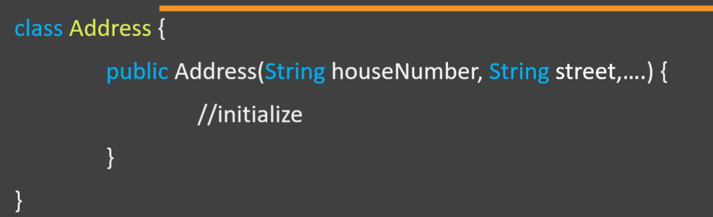
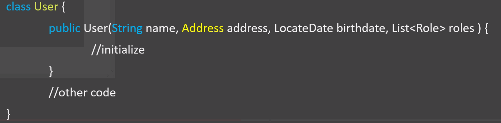
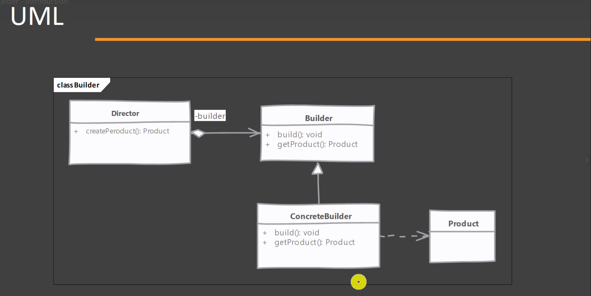

# Builder Design Pattern

Builder pattern is to avoid having complex constructors. In general, you should avoid having a constructor that takes a large number of parameters.
Because the below problems are faced
  1. Suppose we dont want to pass all the parameters to the constructor.
  2. If we want to pass all the elements we should know the sequence of the constructor also.
 
 A constructor with so many parameters is considered as a bad coding practice.
 Builder Design Pattern can help us in these situation
  1. It will make it easy to use such constructor.
  2. It will help us avoid writing such constructor.
  
  What problems builder design pattern solves ?
  
  Objects that need other objects or "parts" to construct them.
  
  
  
  
  First Create an address object , and multiple role objects and a collection to hold these role and then we can call our constructor.
  There are certain steps need to be followed to create user object.

# What is builder actually ?
  We have a complex process to construct an object involving multiple steps , then builder pattern can help us.
  
  In builder pattern we remove the logic related to object construction from "client" code and abstract it in separate class.
  
   
# Product – 
The product class defines the type of the complex object that is to be generated by the builder pattern.
# Builder – 
This abstract base class defines all of the steps that must be taken in order to correctly create a product. Each step is generally abstract as the actual functionality of the builder is carried out in the concrete subclasses. The GetProduct method is used to return the final product. The builder class is often replaced with a simple interface.
# ConcreteBuilder – 
There may be any number of concrete builder classes inheriting from Builder. These classes contain the functionality to create a particular complex product.

# Director – 
The director class controls the algorithm that generates the final product object. A director object is instantiated and its Construct method is called. The method includes a parameter to capture the specific concrete builder object that is to be used to generate the product. The director then calls methods of the concrete builder in the correct order to generate the product object. On completion of the process, the GetProduct method of the builder object can be used to return the product.
